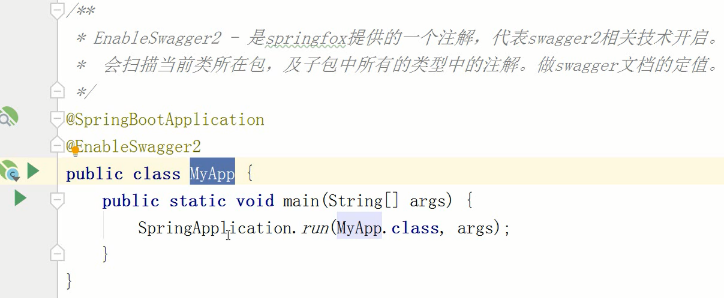

[TOC]
### Swagger 是什么？
Swagger是一种
**能够根据你的代码动态的去生成、更新接口文档**
**解决前后端人员规范不一致，接口文档更新不及时**
的一种技术、框架。
**Swagger可以泛泛理解成：就是后端程序员写完代码不想写接口文档，于是在代码上面嵌注解来代替，注解写完后，代码只要启动了，你就可以通过Swagger UI（一个固定的IP+端口+地址）去查看所有的请求路径接口信息。

#### 主要用Swagger UI 显示接口文档
使用Swagger，就是把相关的接口信息存储在它定义的描述文件里面(yml或json格式)，再通过维护这个描述文件去更新接口文档。
Swagger把这些信息存储之后，它可以通过Swagger UI去显示这个文件。

### Swagger 怎么用？
#### 导入两个依赖
- springfox-swagger2
- springfox-swagger-ui
在springboot启动类上添加@EnableSwagger2注解开启Swagger2

#### 创建SwaggerConfiguration类
可以创建在Config包下，用于配置Swagger。
```
public class SwaggerConfiguration {
	/**
	 * 创建Docket类型的对象。并使用spring容器管理。
	 * Docket是Swagger中的全局配置对象。
	 * @return
	 */
	 @Bean
	 public Docket docket() {
	 	// 通知SwaggerFox用的是SWAGGER_2
	 	Docket docket = new Docket(DocumentationType.SWAGGER_2);
		// API帮助文档的描述信息 information
		ApiInfo apiInfo =
			// 构建器模式创建apiInfo实例
			new APIInfoBuider()
				.contact( // 配置swagger文档主体内容
					new Contact(
						"Swagger开发文档 - 进击的金闪闪" // 文档发布者的名称
						"http://www.bilibili.com" // 文档发布者的网络地址，企业网站
						"disillusion021@gmail.com" // 文档发布者的电子邮箱
					)
				)
				.title("Swagger框架学习帮助文档")
				.description("Swagger框架学习帮助文档详细描述-Swagger框架是一个用于开发RestAPI帮助文档(yml或json格式的存储接口信息的描述文件)的框架")
				.version("1.1")
				.build();
		// 给docket上下文配置api描述信息。
		docket.apiInfo(apiInfo);
		docket = docket
			.select() // 获取Docket中的选择器。返回ApiSelectorBuilder。构建选择器用的。如：扫描哪个包的注解。
			.apis(RequestHandlerSelectors.basePackage("com.bjsxt.controller")); // 设定扫描哪个包(包含子包)中的注解。
			.apis(
				Predicates.not( // 取反。true -> false		false -> true , 为false时就是在Swagger-UI中不显示此方法或接口的描述信息
					RequestHandlerSelectors.withMethodAnnotation( // 当方法上有某个注解的时候返回true
						MyAnnotation4Swagger.class) // 设置检查MyAnnotation4Swagger这个注解
				))
			.paths(
				Predicates.or(
				PathSelectors.regex("/swagger/.*"), // 使用正则表达式，约束生成API文档的路径地址
				PathSelectors.regex("/swagger2/.*"), 
				PathSelectors.regex("/.*"), 
				)
			)
			.build(); // 重新构建Docket对象
		return docket;
	 }
}
```

#### 自定义注解设置不需要生成Swagger接口文档的方法或Controller
- 自定义注解
```
/**
	* @Target - 描述当前的注解可以定义在什么资源看上
	* 属性 value
	* - ElementType.METHOD 可以定义在方法上
	* - ElementType.TYPE 可以定义在类型上
	* - ElementType.FIELD 可以定义在属性上
	* - ElementType.PARAMETER 可以定义在方法参数上
	* @Retention - 当前注解在什么时候生效
	* 属性 value
	* - 定义具体的生效标记
	* - RetentionPolicy.RUNTIME - 运行时有效
	* - RetentionPolicy.SOURCE - 源码中有效
	* - RetentionPolicy.CLASS - 字节码有效
	*/
@Target(value={ElementType.METHOD, ElementType.TYPE})
@Retention(RetentionPolicy.RUNTIME)
public @interface MyAnnotation4Swagger {
	// 自定义注解中的属性。相当于 @MyAnnotation4Swagger(value="")
	String value() default "";
}
```

#### 设置只生成符合特定路径的接口文档
```
.paths(
	Predicates.or(
		PathSelectors.regex("/swagger/.*"), // 使用正则表达式，约束生成API文档的路径地址
		PathSelectors.regex("/swagger2/.*"), 
		PathSelectors.regex("/.*"), 
	)
)
```

### Swagger2 常用注解
#### @Api - 描述当前类型生成接口文档的信息
- tags： 给当前类型定义标签
- description： 给当前类型生成的接扣文档定义个描述信息
@Api(tags={"MyController","Swagger学习控制器"}, description="测试API类型描述信息")
#### @ApiOperation - 描述方法的接口信息
@ApiOperation(value="post方法，执行数据新增操作", notes="Swagger学习使用-处理POST请求的方法")
- value： 必须给出，方法的描述
- notes： 方法的笔记
#### @ApiParam - 描述方法的参数信息
@ApiParam(name="用户名(username)", value="新增用户时提供的用户名", required = true) String a,
@ApiParam(name="密码(password)", value="新增用户提供给的密码",required = true) String b
- name： 描述参数的名称
- value： 参数的简要描述信息
- required： 参数是否是必须的
#### @ApiImplicitParam - 在方法上添加描述方法参数的信息
@ApiImplicitParams(value={
	@ApiImplicitParam(name="m", value="m参数描述信息", required = false),
	@ApiImplicitParam(name="n", value="n参数描述信息", required = true)
})
- name： 描述参数的名称
- value： 参数的简要描述信息
- required： 参数是否是必须的
- dateType: 参数的数据类型
#### @ApiModel - 描述一个实体类型。
#### @ApiModelProperty - 描述实体类属性。
这个实体类型如果成为任何一个生成api帮助文档的方法的返回值类型时，这两个注解会被解析。
@ApiModel(value="自定义实体-MyEntity", description="MyEntity存储用户数据")
	- value: 描述实体类名
	- description: 添加该实体类的简要描述
```
@ApiModelProperty(value="主键"，name="主键(id)"), required=true, example="1", hiddent = "false")
private String id;
@ApiModelProperty(value="姓名"，name="姓名(name)"), required=false, example="张三", hiddent = "false")
private String name;
@ApiModelProperty(value="密码"，name="密码(password)"), required=false, example="10086", hiddent = "false")
private String password;
```
- name： 描述实体类属性名称
- value： 描述实体类属性的简要描述信息
- required： 实体类属性是否为必须
- example： 实体类属性的示例
- hidden： 是不是隐藏的
#### @ApiIgnore - 忽略，当前注解描述的方法和类型，不生成api帮助文档
(其实和自己写的那个自定义注解是一样的作用)
@ApiIgnore